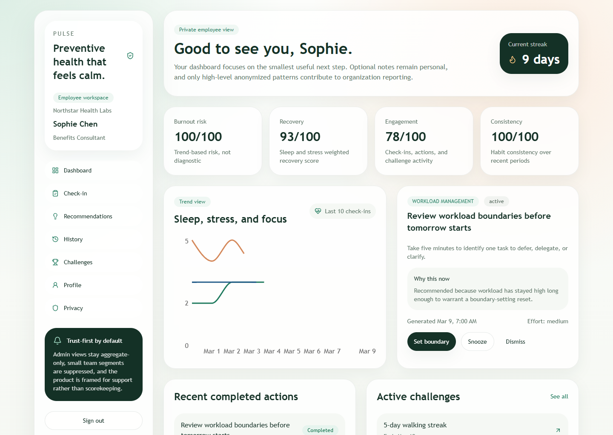
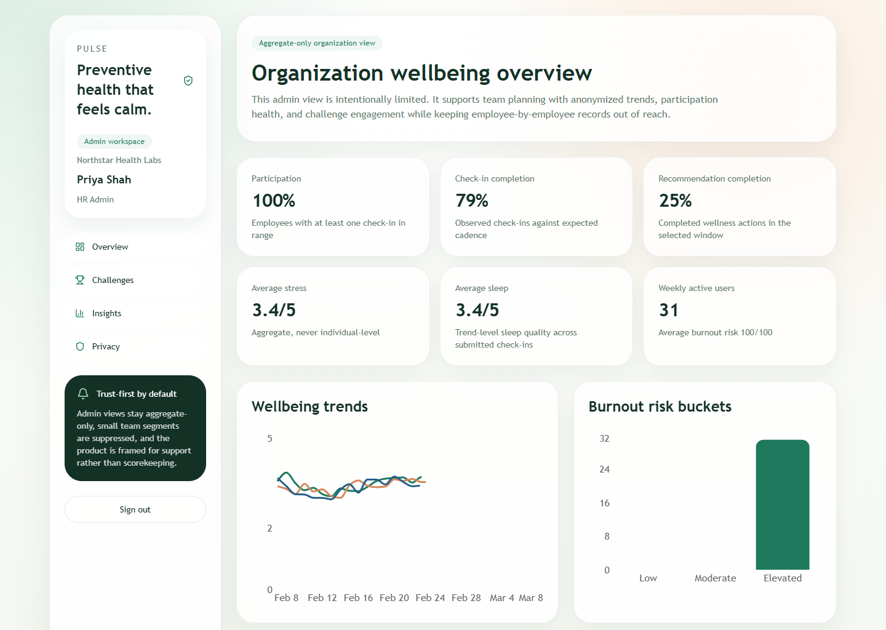

# Pulse Health Track

Pulse Health Track is a trust-centered preventive wellbeing demo for employee support programs. Employees complete short private check-ins about sleep, stress, movement, focus, and workload, then receive explainable recommendations and optional team challenges. Organization views are deliberately limited to anonymized, high-level patterns so the product supports healthier teams without turning into employee monitoring.

## Features

- Employee onboarding, sign-in, check-ins, recommendations, history, profile, and privacy controls
- Organization dashboards for anonymized wellbeing trends, participation, and challenge insights
- Deterministic recommendation engine with transparent scoring logic
- Privacy boundaries such as aggregate-only admin views and small-group suppression
- Seeded demo data so the app is runnable without external auth or database setup
- Prisma schema and seed script for a future PostgreSQL-backed version

## Privacy Approach

- Designed for employee support, reflection, and program planning rather than performance evaluation
- Individual notes, named check-in histories, and person-by-person health timelines stay out of the admin UI
- Small team segments are suppressed so organization reporting remains high level

## Screenshots

### Employee dashboard



### Admin dashboard



## Tech Stack

- Next.js 15
- React 19
- TypeScript
- Tailwind CSS
- Prisma
- Recharts
- Zod

## Getting Started

### Prerequisites

- Node.js 20 or newer
- npm

### Local setup

1. Install dependencies:

   ```bash
   npm install
   ```

2. Start the development server:

   ```bash
   npm run dev
   ```

3. Open [http://localhost:3000](http://localhost:3000).

### Optional database setup

The current MVP runs on seeded in-memory demo data, so a database is not required for local development. If you want to prepare the Prisma/PostgreSQL path:

1. Create a `.env` file with a `DATABASE_URL`.
2. Generate the Prisma client:

   ```bash
   npm run prisma:generate
   ```

3. Push the schema to your database:

   ```bash
   npm run prisma:push
   ```

4. Seed the database:

   ```bash
   npm run seed
   ```

## Notes

- Demo authentication is cookie-based, so no external auth provider is required to explore the app
- Live app reads currently use seeded in-memory data; Prisma and PostgreSQL are scaffolded for the next iteration
- Organization-facing views are intentionally limited and framed for support rather than employee scorekeeping.
- This project is a product prototype and not a medical device
